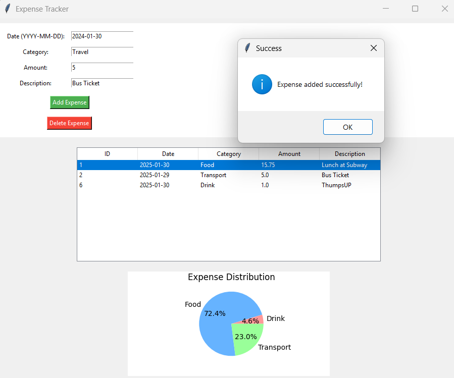
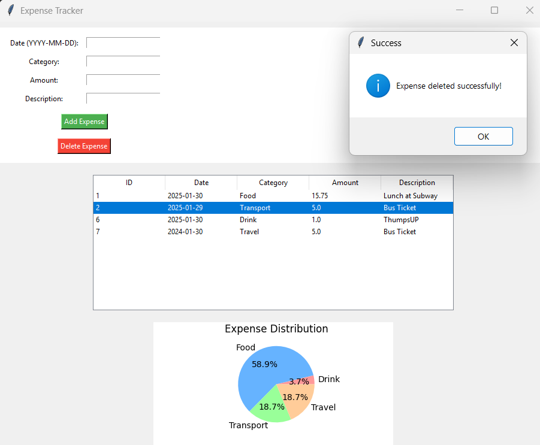
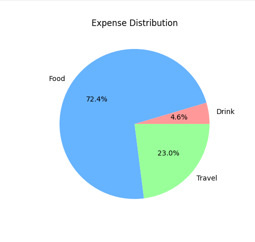

# 💰 Expense Tracker  

A simple Expense Tracker application using Python, Tkinter, and SQLite. This tool helps you record, view, and visualize your expenses easily.

---

## 📌 Features  
✅ Add, View, and Delete Expenses  
✅ Stores data using SQLite database  
✅ GUI built with Tkinter  
✅ Pie Chart visualization using Matplotlib  

## 🛠 **Installation**  

1. **Clone the Repository**  
   >>git clone https://github.com/TechieTurtle/Expense-Tracker.git
   >>cd Expense-Tracker

2. **Install Dependencies**
    >>pip install matplotlib tk

3. **Run the Application**
    >>python gui.py

**Usage:**

-->Add an Expense: Enter Date, Category, Amount, and Description, then click "Add Expense".

-->View Expenses: The list will display all saved expenses.

-->Delete an Expense: Select an expense from the list and click "Delete Expense".

-->View Expense Chart: A Pie Chart will show the expense distribution by category.

**Screenshots**

### ✅ Home Page
  

### ✅ Expense Added  

### ✅ Expense Deleted  

### ✅ Expense Chart  

**🛠 Technologies Used**

-->Python

-->Tkinter (for GUI)

-->SQLite (for database)

-->Matplotlib (for expense visualization)