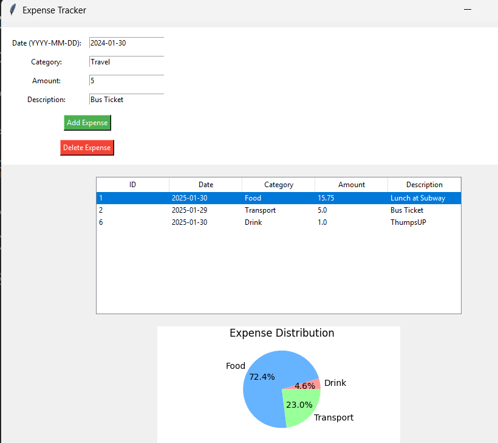
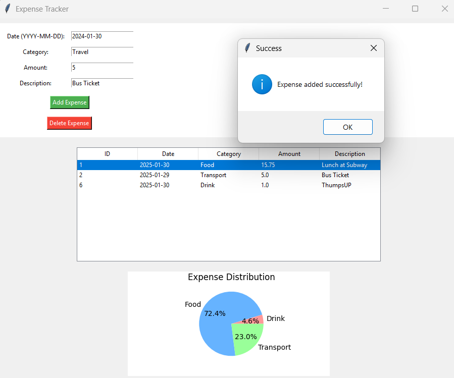
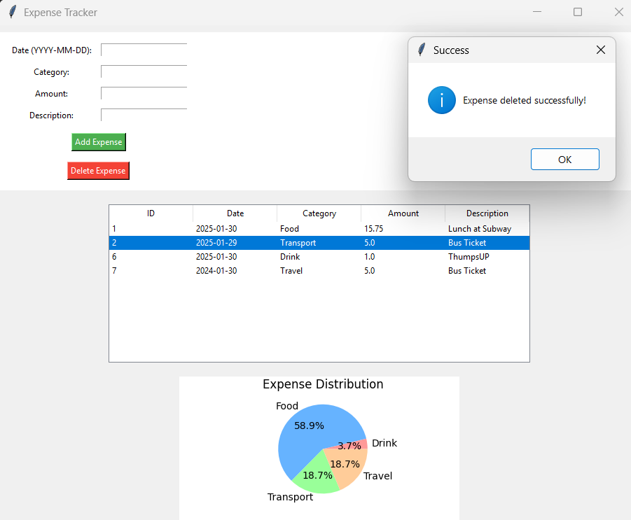
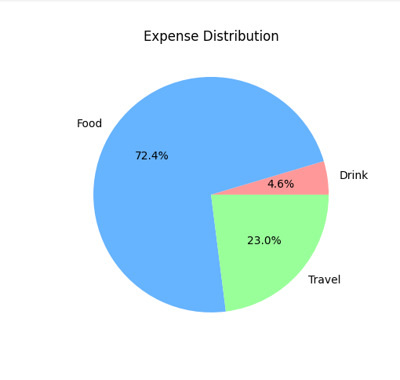

# 💰 Expense Tracker

A simple and easy-to-use Expense Tracker application built with Python, Tkinter, and SQLite. It helps you record, manage, and visualize your expenses effortlessly.

---

## 📌 Features

- ✅ Add, View, and Delete Expenses
- ✅ Stores data securely using SQLite
- ✅ User-friendly GUI with Tkinter
- ✅ Visualize expenses with a Pie Chart (Matplotlib)

---

## 🛠 Installation

1. **Clone the Repository**
   ```sh
   git clone https://github.com/TechieTurtle/Expense-Tracker.git
   cd Expense-Tracker
   ```

2. **Install Dependencies**
   ```sh
   pip install matplotlib tk
   ```

3. **Run the Application**
   ```sh
   python gui.py
   ```

---

## 🚀 Usage

- **Add Expense:** Enter Date, Category, Amount, and Description, then click "Add Expense".
- **View Expenses:** Displays all recorded expenses.
- **Delete Expense:** Select an expense and click "Delete Expense".
- **Expense Chart:** View a Pie Chart of expenses by category.

---

## 📸 Screenshots

### ✅ Home Page


### ✅ Expense Added


### ✅ Expense Deleted


### ✅ Expense Chart


---

## 🛠 Technologies Used

- **Python** (Core functionality)
- **Tkinter** (GUI)
- **SQLite** (Database)
- **Matplotlib** (Charts & Visualization)

- YOU CAN TRY MY APP WITH THE BELOW .exe file or CLI version with below link provided:

  https://drive.google.com/file/d/1f87P-Ih4FusPfzj8TZBVwIKByfp3UPWQ/view?usp=drive_link
